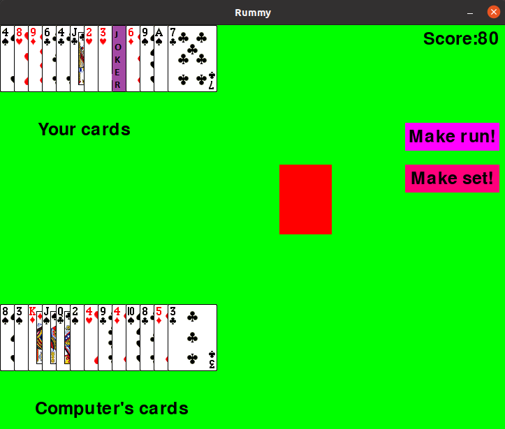

# Rummy
Single player implementation of the famous card game Rummy in python
2 player-computer and human
deck of 52 cards and 4 jokers
## Score
* 80 if no set/run made
* otherwise:
   | Card | Points |
   | ------------- | ------------- |
   | A  | 1  |
   | 1  | 1  |
   | 2  | 2 |
   | 3  | 3  |
   | 4  | 4  |
   | 5  | 5  |
   | 6  | 6  |
   | 7  | 7  |
   | 8  | 8  |
   | 9  | 9  |
   | 10 | 10  |
   | J | 11  |
   | Q | 12  |
   | K | 13  |
   | Joker | 0  |
for every card not in a set or run
### SET
sequence of 3/4 cards of same value or having 1 card as joker
### RUN
sequence of >=3 consecutive cards of same suite
## Rules
1. At the beginning cards are given at random to computer
and human.
2. At player's turn he/she must pick a card either discarded
by computer in previous turn or open a new card from the deck.
3. After picking a card the player must discard a card from the deck.
4. To make RUN/SET:
   1. Press SHIFT KEY and click on the respective cards
   2. Then click on Make Run/Make Set button
     
 ## Starting Page

## Gameplay

